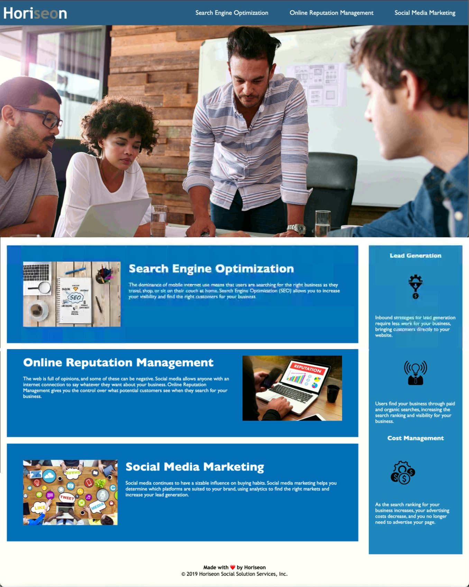

# Horiseon Marketing Agency

## Project Managedment

Horiseon Weboage wanted to upgrate their codebase and make sure that everything works properly.

### Client Requirements

- GIVEN a webpage meets accessibility standards

- WHEN I view the source code
 
- THEN I find semantic HTML elements

- WHEN I view the structure of the HTML elements

- THEN I find that the elements follow a logical structure independent of styling and positioning

- WHEN I view the icon and image elements

- THEN I find accessible alt attributes

- WHEN I view the heading attributes

- THEN they fall in sequential order

- WHEN I view the title element

- THEN I find a concise, descriptive title

### Client Goal criteria was made though the following actions
* Added semantic HTML elements
* Added alt attributes to the images and links
* Relabeled title element
* Linked the CSS file in the HTML
* Added meta tags
* Revamped headings into sequential order
* Added alt attributes to image tags 
* Added meta tags

* Result

### Screenshot of deployed site

Web page

# 🔗 Links

https://goldie369.github.io/Code-Refactor/

https://github.com/Goldie369/Code-Refactor

MIT License

Copyright (c) 2023 Goldie Rizova

